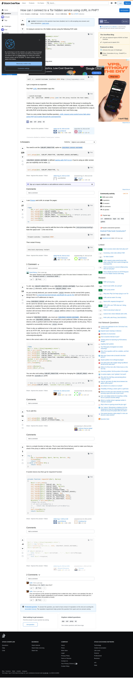

# Visited: https://stackoverflow.com/questions/15445285/how-can-i-connect-to-a-tor-hidden-service-using-curl-in-php
**Time:** Sun May 10 15:40:28 UTC 2026

## Favicon

## Screenshot

## Raw HTML
[page.html](./page.html)

## Downloaded Media (1 files)
## Downloaded Media Files

## Other Links
- [#](#)
- [#comment139849711_78257607](#comment139849711_78257607)
- [#comment139849725_78257607](#comment139849725_78257607)
- [#comment62098278_16764916](#comment62098278_16764916)
- [#content](#content)
- [/](/)
- [/a/15819615](/a/15819615)
- [/a/16764916](/a/16764916)
- [/a/18293978](/a/18293978)
- [/a/55436526](/a/55436526)
- [/a/68110376](/a/68110376)
- [/a/78257607](/a/78257607)
- [/beta/challenges](/beta/challenges)
- [/collectives](/collectives)
- [/collectives-all](/collectives-all)
- [/collectives/php](/collectives/php)
- [/contact](/contact)
- [/feeds/question/15445285](/feeds/question/15445285)
- [/help](/help)
- [/help/locked-posts](/help/locked-posts)
- [/help/privileges/protect-questions](/help/privileges/protect-questions)
- [/opensearch.xml](/opensearch.xml)
- [/posts/15445285/edit](/posts/15445285/edit)
- [/posts/15445285/ivc/11ab?prg=85fe01f0-6fea-4f09-91cd-60eec535e112](/posts/15445285/ivc/11ab?prg=85fe01f0-6fea-4f09-91cd-60eec535e112)
- [/posts/15445285/revisions](/posts/15445285/revisions)
- [/posts/15445285/timeline](/posts/15445285/timeline)
- [/posts/15819615/edit](/posts/15819615/edit)
- [/posts/15819615/timeline](/posts/15819615/timeline)
- [/posts/16764916/edit](/posts/16764916/edit)
- [/posts/16764916/revisions](/posts/16764916/revisions)
- [/posts/16764916/timeline](/posts/16764916/timeline)
- [/posts/18293978/edit](/posts/18293978/edit)
- [/posts/18293978/revisions](/posts/18293978/revisions)
- [/posts/18293978/timeline](/posts/18293978/timeline)
- [/posts/55436526/edit](/posts/55436526/edit)
- [/posts/55436526/revisions](/posts/55436526/revisions)
- [/posts/55436526/timeline](/posts/55436526/timeline)
- [/posts/68110376/edit](/posts/68110376/edit)
- [/posts/68110376/revisions](/posts/68110376/revisions)
- [/posts/68110376/timeline](/posts/68110376/timeline)
- [/posts/78257607/edit](/posts/78257607/edit)
- [/posts/78257607/revisions](/posts/78257607/revisions)
- [/posts/78257607/timeline](/posts/78257607/timeline)
- [/px.js?ch=1](/px.js?ch=1)
- [/px.js?ch=2](/px.js?ch=2)
- [/q/15445285](/q/15445285)
- [/questions](/questions)
- [/questions/14944067/curl-request-using-socks5-proxy-fails-when-using-php-but-it-works-through-the-c](/questions/14944067/curl-request-using-socks5-proxy-fails-when-using-php-but-it-works-through-the-c)
- [/questions/14944067/curl-request-using-socks5-proxy-fails-when-using-php-but-it-works-through-the-c?noredirect=1](/questions/14944067/curl-request-using-socks5-proxy-fails-when-using-php-but-it-works-through-the-c?noredirect=1)
- [/questions/15445285/how-can-i-connect-to-a-tor-hidden-service-using-curl-in-php](/questions/15445285/how-can-i-connect-to-a-tor-hidden-service-using-curl-in-php)

## Stats
- Links: 229
- Media: 1
